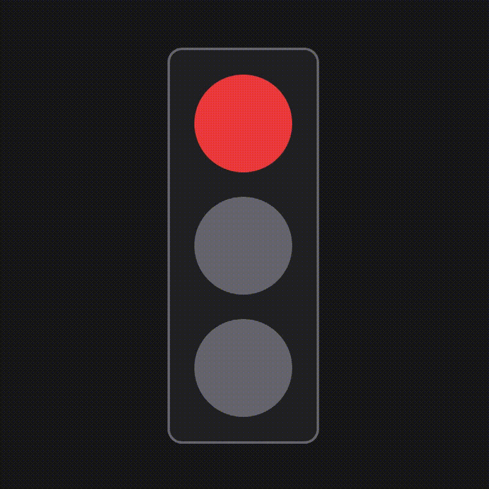

# React Challenges

I post here small projects that I have created for fun and practice in React. These are my personal approaches to various problems, some of which I have learned from the internet, particularly from the [WebDevCody](https://www.youtube.com/@WebDevCody) channel on YouTube. Thank you, Cody!

## Disclaimer

Each project is stored in a different branch. To view the source code, click on the headline or check it out locally via the shell.

## [Traffic Lights](https://github.com/MoDrazzz/react-challenges/tree/traffic-lights)

```
git switch traffic-lights
```

The idea is to build a component that represents traffic lights. It should change bulbs color in intervals.

---



---

Source: [WebDevCody](https://www.youtube.com/watch?v=plFo3jJRTdE) <br />
